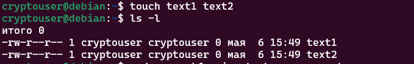
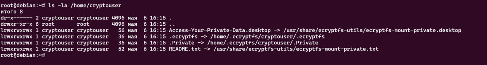
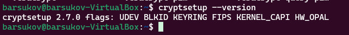
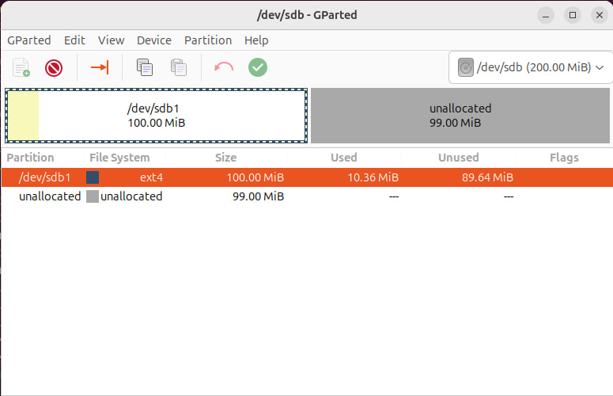
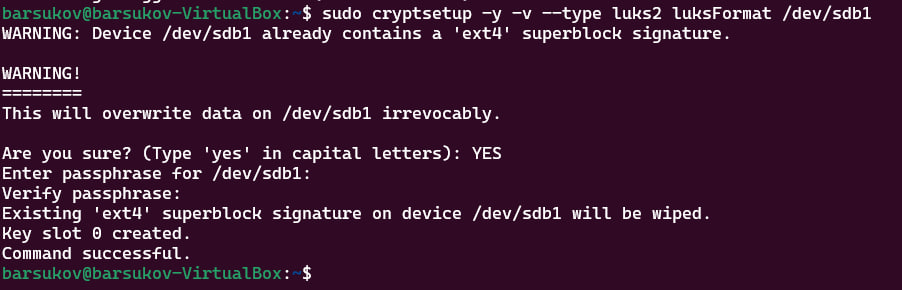
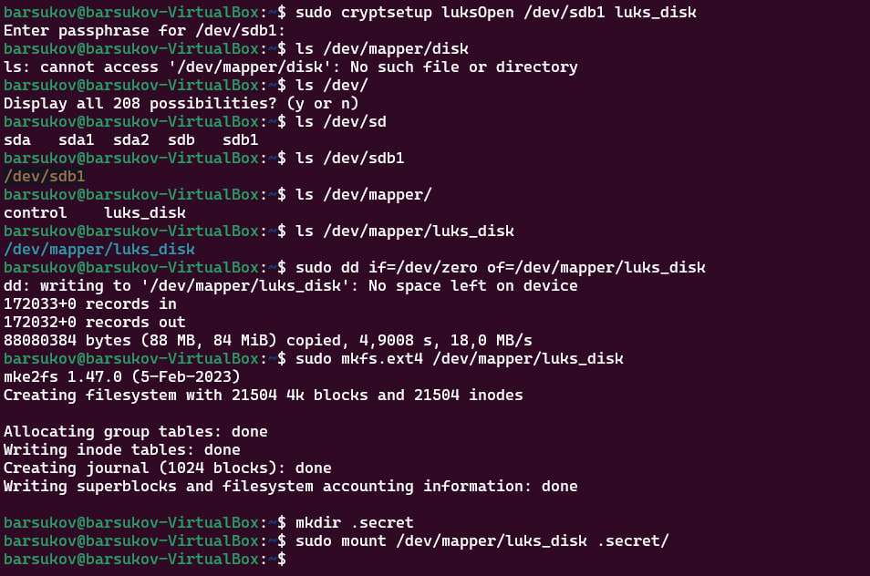

# Домашнее задание к занятию  «Защита хоста» Барсуков Алексей

### Инструкция по выполнению домашнего задания

1. Сделайте fork [репозитория c шаблоном решения](https://github.com/netology-code/sys-pattern-homework) к себе в Github и переименуйте его по названию или номеру занятия, например, https://github.com/имя-вашего-репозитория/gitlab-hw или https://github.com/имя-вашего-репозитория/8-03-hw).
2. Выполните клонирование этого репозитория к себе на ПК с помощью команды `git clone`.
3. Выполните домашнее задание и заполните у себя локально этот файл README.md:
   - впишите вверху название занятия и ваши фамилию и имя;
   - в каждом задании добавьте решение в требуемом виде: текст/код/скриншоты/ссылка;
   - для корректного добавления скриншотов воспользуйтесь инструкцией [«Как вставить скриншот в шаблон с решением»](https://github.com/netology-code/sys-pattern-homework/blob/main/screen-instruction.md);
   - при оформлении используйте возможности языка разметки md. Коротко об этом можно посмотреть в [инструкции по MarkDown](https://github.com/netology-code/sys-pattern-homework/blob/main/md-instruction.md).
4. После завершения работы над домашним заданием сделайте коммит (`git commit -m "comment"`) и отправьте его на Github (`git push origin`).
5. Для проверки домашнего задания преподавателем в личном кабинете прикрепите и отправьте ссылку на решение в виде md-файла в вашем Github.
6. Любые вопросы задавайте в чате учебной группы и/или в разделе «Вопросы по заданию» в личном кабинете.

Желаем успехов в выполнении домашнего задания.

------

### Задание 1

1. Установите **eCryptfs**.
2. Добавьте пользователя cryptouser.
3. Зашифруйте домашний каталог пользователя с помощью eCryptfs.

**Ответ:**

1. Установим **ecryptfs** в ВМ под управлением **Ubuntu 22.04.2**:
```
apt install ecryptfs-utils cryptsetup -y
```
2. Добавим пользователя **cryptouser**:
```
sudo adduser cryptouser
su - cryptouser
```

3. Зашифруйте домашний каталог пользователя **/home/cryptouser** с помощью **eCryptfs**:
```
touch text1 text2
```
- Посмотрим содержимое еще не зашифрованной домашней директории пользователя:
  


- Зашифруем содержимое каталога:
```
sudo ecryptfs-migrate-home -u cryptouser
sudo ls -la /home/cryptouser
```


---


### Задание 2

1. Установите поддержку **LUKS**.
```
sudo apt install cryptsetup -y
```



2. Создайте небольшой раздел, например, 100 Мб.




3. Зашифруйте созданный раздел с помощью LUKS.

```
sudo cryptsetup -y -v --type luks2 luksFormat /dev/sdb1

```



Смонтируем раздел:


```
sudo cryptsetup luksOpen /dev/sdb1 luks_disk
ls /dev/mapper/disk
```

Отформатируем раздел:
```
sudo dd if=/dev/zero of=/dev/mapper/luks_disk
sudo mkfs.ext4 /dev/mapper/luks_disk
```
Монтирование открытого раздела:
```
mkdir .secret
sudo mount /dev/mapper/luks_disk .secret/
```



